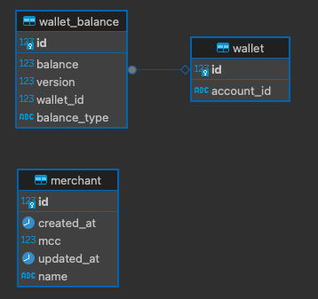

# Desafio Técnico para fazer em casa

# Índice

1. [Introdução](#introdução)
2. [Transaction](#transaction)
    - [Atributos](#atributos)
3. [Desafios](#desafios)
    - [L1. Autorizador Simples](#l1-autorizador-simples)
    - [L2. Autorizador com Fallback](#l2-autorizador-com-fallback)
    - [L3. Dependente do Comerciante](#l3-dependente-do-comerciante)
    - [L4. Questão Aberta](#l4-questão-aberta)
4. [Solução](#solução)
    - [Reference Documentation](#reference-documentation)
    - [Estrutura de Dados](#estrutura-de-dados)
    - [Como Executar?](#como-executar)
    - [Como Estamos Lidando com Concorrência](#como-estamos-lidando-com-concorrência)


# Introdução

Autorizar uma transação com cartão de crédito é o pão com manteiga da vida no Caju. Este teste visa dar uma olhada nas diferentes estratégias que os candidatos podem ter ao implementar este recurso crucial.

Além de avaliar a correção da sua solução, temos interesse em ver como você modela o domínio, organiza seu código e implementa seus testes. **Para implementar sua solução, você pode escolher sua linguagens favorita, dentre das linguagens baseadas na JVM (Clojure, Scala, Java, Kotlin, etc.)**

Bibliotecas são, obviamente, permitidas e você pode escolher o banco de dados de sua preferência.
Primeiro, vamos guiá-lo através de alguns conceitos básicos.

# Transaction

---

Uma versão simplificada de um transaction payload de cartão de crédito é o seguinte:

```json
{
	"account": "123",
	"totalAmount": 100.00,
	"mcc": "5811",
	"merchant": "PADARIA DO ZE               SAO PAULO BR"
}
```

## Atributos

- **id** - Um identificador único para esta transação.
- **accountId** - Um identificador para a conta.
- **amount** - O valor a ser debitado de um saldo.
- **merchant** - O nome do estabelecimento.
- **mcc** - Um código numérico de 4 dígitos que classifica os estabelecimentos
  comerciais de acordo com o tipo de produto vendido ou serviço prestado.

  O `MCC` contém a classificação do estabelecimento. Baseado no seu valor, deve-se
  decidir qual o saldo será utilizado (na totalidade do valor da transação). Por
  simplicidade, vamos usar a seguinte regra:

    - Se o `mcc` for `"5411"` ou `"5412"`, deve-se utilizar o saldo de `FOOD`.
    - Se o `mcc` for `"5811"` ou `"5812"`, deve-se utilizar o saldo de `MEAL`.
    - Para quaisquer outros valores do `mcc`, deve-se utilizar o saldo de `CASH`


## Desafios


Cada um dos desafios a seguir são etapas na criação de um **autorizador completo**. Seu autorizador deve ser um servidor HTTP que processe a transaction payload JSON usando as regras a seguir.

As possíveis respostas são:

- `{ "code": "00" }` se a transação é **aprovada**
- `{ "code": "51" }` se a transação é **rejeitada**, porque não tem saldo suficiente
- `{ "code": "07" }` se acontecer qualquer outro problema que impeça a transação de ser processada

O HTTP Status Code é sempre **200**

## L1. Autorizador simples

O **autorizador simples** deve funcionar da seguinte forma:
-  Recebe a transação
-  Usa **apenas** a MCC para mapear a transação para uma categoria de benefícios
-  Aprova ou rejeita a transação
-  Caso a transação seja aprovada, o saldo da categoria mapeada deverá ser diminuído em **totalAmount**.


## L2. Autorizador com fallback

Para despesas não relacionadas a benefícios, criamos outra categoria, chamada **CASH**.
O autorizador com fallback deve funcionar como o autorizador simples, com a seguinte diferença:
- Se a MCC não puder ser mapeado para uma categoria de benefícios ou se o saldo da categoria fornecida não for suficiente para pagar a transação inteira, verifica o saldo de **CASH** e, se for suficiente, debita esse saldo.

## L3.Dependente do comerciante

As vezes, os MCCs estão incorretos e uma transação deve ser processada levando em consideração também os dados do comerciante. Crie um mecanismo para substituir MCCs com base no nome do comerciante. O nome do comerciante tem maior precedência sobre as MCCs

Exemplos:

- `UBER TRIP                   SAO PAULO BR`
- `UBER EATS                   SAO PAULO BR`
- `PAG*JoseDaSilva          RIO DE JANEI BR`
- `PICPAY*BILHETEUNICO           GOIANIA BR`

## L4. Questão aberta

A seguir está uma questão aberta sobre um recurso importante de um autorizador completo (que você não precisa implementar, apenas discuta da maneira que achar adequada, como texto, diagramas, etc.).

- Transações simultâneas: dado que o mesmo cartão de crédito pode ser utilizado em diferentes serviços online, existe uma pequena mas existente probabilidade de ocorrerem duas transações ao mesmo tempo. O que você faria para garantir que apenas uma transação por conta fosse processada em um determinado momento? Esteja ciente do fato de que todas as solicitações de transação são síncronas e devem ser processadas rapidamente (menos de 100 ms), ou a transação atingirá o timeout.

---

**Para este teste, tente ao máximo implementar um sistema de autorização de transações considerando todos os desafios apresentados (L1 a L4) e conceitos básicos.**


# Solução

### Reference Documentation
O serviço foi criado utilizando clean architecture como demonstra a imagem abaixo

* [Official Apache Maven documentation](https://maven.apache.org/guides/index.html)
* [Spring Boot Maven Plugin Reference Guide](https://docs.spring.io/spring-boot/3.3.2/maven-plugin)
* [Spring Web](https://docs.spring.io/spring-boot/docs/3.3.2/reference/htmlsingle/index.html#web)
* [Spring Data JPA](https://docs.spring.io/spring-boot/docs/3.3.2/reference/htmlsingle/index.html#data.sql.jpa-and-spring-data)
* [Flyway Migration](https://docs.spring.io/spring-boot/docs/3.3.2/reference/htmlsingle/index.html#howto.data-initialization.migration-tool.flyway)
* [Retryable Spring](https://docs.spring.io/spring-retry/docs/api/current/org/springframework/retry/annotation/Retryable.html)
* [Spring OpenApi - Swagger](https://www.baeldung.com/spring-rest-openapi-documentation)
* [Docker compose](https://docs.docker.com/compose/)
* [PostgreSQL](https://www.postgresql.org/docs/)

### Entidades:

<p>
  
</p>

### Como executar?

- Baixando projeto
  ```shell
  git clone git@github.com:Christianmsousa/ms-caju-desafio.git && cd ms-caju-desafio
  ```
- download dependencies
  ```shell
  mvn clean install
  ```

- Inicializando o PostgreSQL com docker
  ```shell
    docker-compose -p cajudb up -d
  ```

- Gerando tabelas com flyway
  ```shell
    mvn flyway:migrate
  ```
  
- Inicializar o projeto
  ```shell
  mvn spring-boot:run
  ```


### Como Estamos Lidando com Concorrência

Em sistemas com alta concorrência, garantir a integridade dos dados sem bloqueios pesados é essencial. Otimistic locking permite múltiplas transações simultâneas e previne conflitos de dados, garantindo que apenas uma transação possa modificar um registro por vez.

**Como funciona?**

1. Versão do Registro: Cada registro tem um campo de versão que é incrementado a cada atualização.
2. Leitura e Atualização: A versão lida é enviada com a atualização. O sistema verifica se a versão do registro corresponde à versão enviada.
3. Validação: Se as versões corresponderem, a atualização é aplicada e a versão é incrementada. Caso contrário, a atualização é rejeitada e a transação precisa ser reprocessada.

**Implementação**
- Modelo de Dados: Inclui um campo de versão nas entidades para controle.
- Atualização com Versionamento: As atualizações verificam a versão para evitar conflitos.
- Tratamento de Conflitos: Se a atualização falhar devido a um conflito de versão, a transação deve ser reprocessada.

